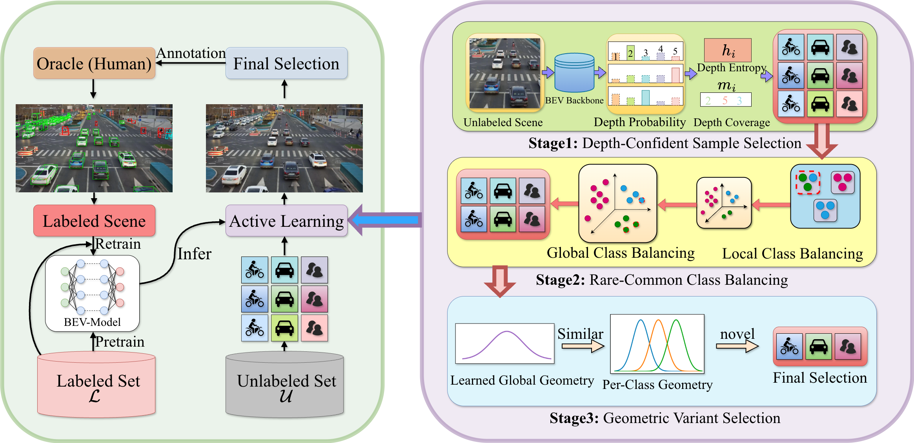

<p align="center">
  <h1 align="center">Learnability-Driven Submodular Optimization for<br>Active Roadside 3D Detection</h1>

  <p align="center">
    <a href="https://www.linkedin.com/in/ruiyu-mao-9568292b6/"><strong>Ruiyu Mao</strong></a><sup>1</sup>
    &nbsp;&nbsp;·&nbsp;&nbsp;
    <a href="https://www.linkedin.com/in/baoming-zhang-286083313/"><strong>Baoming Zhang</strong></a><sup>1</sup>
    &nbsp;&nbsp;·&nbsp;&nbsp;
    <a href="https://personal.utdallas.edu/~nicholas.ruozzi/"><strong>Nicholas Ruozzi</strong></a><sup>1</sup>
    &nbsp;&nbsp;·&nbsp;&nbsp;
    <a href="https://yunhuiguo.github.io/"><strong>Yunhui Guo</strong></a><sup>1</sup>
  </p>

  <p align="center">
  <sup>1</sup>The University of Texas at Dallas<br>
  <b>CVPR 2026</b>
  </p>

  <p align="center">
  <a href="https://arxiv.org/pdf/2601.01695"></a>
  <a href="YOUR_PROJECT_PAGE_URL"></a>
</p>

<p align="center">
  
</p>
</p>

This repository contains the official implementation of **LH3D** — a learnability-driven active learning framework for vision-based roadside 3D object detection. Built on top of [BEVHeight](https://arxiv.org/abs/2303.08498), LH3D selects the most informative training samples under a fixed annotation budget using a three-stage submodular selection strategy driven by depth learnability, spatial diversity, and geometric similarity.

---

# Getting Started

### Installation

See [docs/install.md](docs/install.md) for environment setup.

### Dataset Preparation

See [docs/prepare_dataset.md](docs/prepare_dataset.md) for DAIR-V2X-I and Rope3D setup.

<!-- ### Fully-Supervised Training (BEVHeight baseline)

```bash
# Train with 8 GPUs
python exps/dair-v2x/bev_height_lss_r50_864_1536_128x128_102.py \
  --amp_backend native -b 8 --gpus 8

# Evaluate
python exps/dair-v2x/bev_height_lss_r50_864_1536_128x128_102.py \
  --ckpt_path [CKPT_PATH] -e -b 8 --gpus 8
``` -->

### Training with LH3D

```bash
# DAIR-V2X-I
python exps/dair-v2x/bev_height_lss_r50_864_1536_128x128_active.py \
  --al_enabled \
  --al_method lh3d \
  --al_init_size 500 \
  --al_query_size 120 \
  --al_rounds 10 \
  --al_epochs_per_round 5 \
  --al_max_objects 32000 \

# Rope3D
python exps/rope3d/bev_height_lss_r50_864_1536_128x128_active.py \
  --al_enabled \
  --al_method lh3d \
  --al_init_size 500 \
  --al_query_size 120 \
  --al_rounds 10 \
  --al_epochs_per_round 5 \
  --al_max_objects 32000 \
```

---

# Acknowledgment

This project builds on the following works:

- [BEVHeight](https://github.com/ADLab-AutoDrive/BEVHeight) — roadside 3D detection backbone (CVPR 2023)
- [BEVDepth](https://github.com/Megvii-BaseDetection/BEVDepth) — LSS-based depth estimation
- [DAIR-V2X](https://github.com/AIR-THU/DAIR-V2X) — dataset and evaluation toolkit
- [pypcd](https://github.com/dimatura/pypcd) — point cloud utilities

---
# Incoming

- Release the pretrained models

---

# Citation

If you find this work useful, please cite our paper:

```bibtex
@article{mao2026learnability,
  title={Learnability-Driven Submodular Optimization for Active Roadside 3D Detection},
  author={Mao, Ruiyu and Zhang, Baoming and Ruozzi, Nicholas and Guo, Yunhui},
  journal={arXiv preprint arXiv:2601.01695},
  year={2026}
}
```
